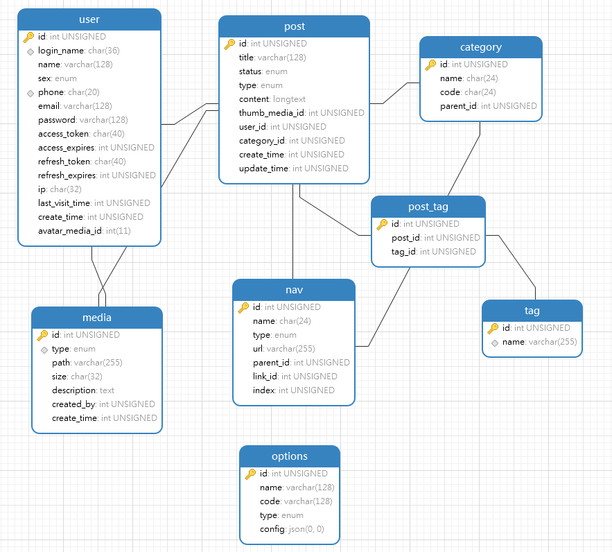

# cms

- 后端使用 webman 基于 workerman 高性能php框架
- 前端使用 vue 构建

# 设计说明

数据表结构参考了 wordpress

# 开发进度

- [x] 后端接口
- [ ] 前端后台面板
- [ ] 前端前台 demo

# API 接口文档

- [x] [用户接口](/wiki/User.md)
- [x] [配置接口](/wiki/Options.md)
- [x] [媒体接口](/wiki/Media.md)
- [x] [标签接口](/wiki/Tag.md)
- [x] [分类接口](/wiki/Category.md)
- [x] [导航接口](/wiki/Navigation.md)
- [x] [文章接口](/wiki/Post.md)

# 安装部署

待更新……